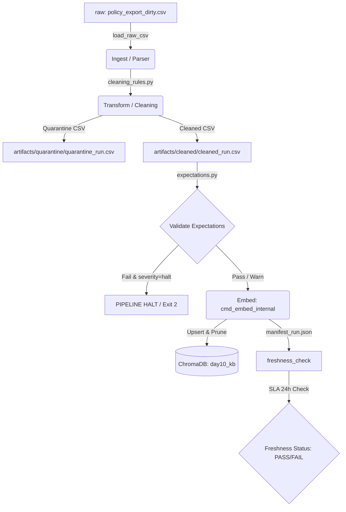

# Kiến trúc pipeline — Lab Day 10

**Nhóm:** IT-CS-Data-Ops  
**Cập nhật:** 2026-06-10

---

## 1. Sơ đồ luồng dữ liệu

- **Freshness:** Đo tại boundary `publish` (dựa trên manifest).
- **Run ID:** Được sinh tự động theo định dạng UTC timestamp `%Y-%m-%dT%H-%MZ` (hoặc đặt qua `--run-id`).
- **Quarantine:** Lưu các dòng dữ liệu không đạt yêu cầu cấu trúc hoặc stale kèm theo cột `reason` và thông tin lỗi.

---

## 2. Ranh giới trách nhiệm

| Thành phần | Input | Output | Trách nhiệm chính |
|------------|-------|--------|-------------------|
| **Ingest** | `data/raw/policy_export_dirty.csv` | `List[Dict[str, str]]` | Đọc dữ liệu từ file thô CSV, xử lý khoảng trắng. |
| **Transform** | `List[Dict[str, str]]` | `cleaned` & `quarantine` | Chuẩn hóa định dạng ngày, lọc doc_id hợp lệ, áp dụng các rule làm sạch text (tiền tố bẩn, lặp từ, stale policy). |
| **Quality** | `cleaned` rows | `results` & `should_halt` | Chạy bộ kiểm định chất lượng (Expectations), dừng pipeline nếu lỗi nghiêm trọng (`halt`), cảnh báo nếu là lỗi nhẹ (`warn`). |
| **Embed** | Cleaned CSV | `day10_kb` Collection | Tạo vector embedding bằng model `all-MiniLM-L6-v2`, đồng bộ dữ liệu vào ChromaDB. |
| **Monitor** | `manifest_*.json` | Freshness status | Theo dõi thời gian cập nhật dữ liệu và kiểm tra SLA (24h). |

---

## 3. Idempotency & rerun

Đường ống dẫn dữ liệu được thiết kế đảm bảo tính **idempotent (nhất quán khi chạy lại)** bằng hai cơ chế:
1. **Upsert theo chunk_id ổn định:** Mỗi chunk được gán một `chunk_id` ổn định dựa trên hàm hash `_stable_chunk_id(doc_id, chunk_text, seq)`. Khi chạy lại pipeline, ChromaDB sẽ ghi đè (upsert) lên các chunk cũ nếu trùng ID, tránh việc nhân bản dữ liệu.
2. **Prune vector cũ:** Sau khi upsert dữ liệu mới, pipeline sẽ tìm và xóa (`col.delete`) tất cả các vector ID tồn tại trong DB nhưng không xuất hiện trong file cleaned của lượt chạy hiện tại. Điều này ngăn việc dữ liệu stale/cũ còn sót lại làm ảnh hưởng đến RAG.

---

## 4. Liên hệ Day 09

Pipeline này cung cấp corpus tri thức sạch cho các Agent từ Day 09. Thay vì các Agent đọc dữ liệu trực tiếp từ các file văn bản thô chưa được làm sạch hoặc chứa các phiên bản mâu thuẫn (Ví dụ: chính sách phép năm 10 ngày cũ vs 12 ngày mới), pipeline ETL làm sạch dữ liệu trước, đảm bảo Vector Database chỉ chứa thông tin canonical chính xác nhất, từ đó giúp Agent trả lời chính xác và không bị ảo giác.

---

## 5. Rủi ro đã biết

- **Độ lệch múi giờ (Timezone skew):** Dữ liệu raw xuất ra không đồng bộ múi giờ có thể làm sai lệch kết quả kiểm tra `freshness`.
- **Độ trễ khi tải mô hình (Model download latency):** Lần đầu tiên chạy SentenceTransformers yêu cầu kết nối Internet để tải model `all-MiniLM-L6-v2` (~90MB).
